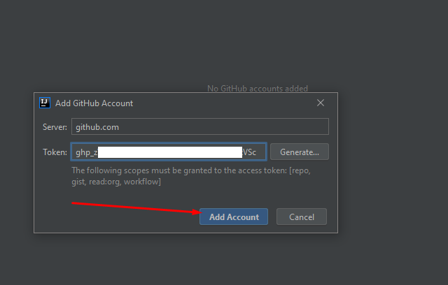

# Настройка git
`win+r` -> `cmd` -> `git config --global user.name "Ваше имя и фамилия"` Таким образом вы задаете имя которое будет в поле автор у всех ваших комитов.

`win+r` -> `cmd` -> `git config --global user.email johndoe@example.com` Таким образом вы задаете email который будет в поле автор у всех ваших комитов. (я бы здесь менял только часть до собаки. незачем ваш настоящий email в интрнете светить)

# Настройка GitHub
Авторизуемся (входим по нашему).

топаем вот сюда: [https://github.com/settings/tokens](https://github.com/settings/tokens)

Нажимаем сгенерировать токен.

Даем токену имя. Выбираем через какое время он истечет! отмечаем привелегии.
идее требуются  repo,workflow,read:org,gist

нажимаем кнопку сгенерировать.

Вы великолепны! Ваш токен готов!  копируйте его в буфер обмена.
шаги 1-4 надо повторить для всех токенов которые вам нужны.
Например желательно иметь разные токены для работы дома и учебного кабинета, что бри необходимости любой из нех просто снести в личном кабинете.

Открываем Idea

Идем в настроки.

Version Control -> GitHub -> тискаем плюсик.

Выбираем логин через токен.

Вставляем токен, который скопировали в буфер обмена.
Проверям. Все работает. Вы опять великолепны!

Отдельные токены можно сохранить в файлик на флэшку и вставить в школе в идею, для того чтобы не морочить себе голову с аутентификаций на гитхабе на школьном компьютере. 